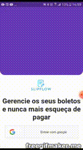

# slipflow

Slipflow é um aplicativo feito flutter baseado em em aplicativo feito na nlw 6
bar code usando firebase ml
salva os boletos em shared preferences
## interface do aplicativo

## para começar 

This project is a starting point for a Flutter application.

A few resources to get you started if this is your first Flutter project:

- [Lab: Write your first Flutter app](https://flutter.dev/docs/get-started/codelab)
- [Cookbook: Useful Flutter samples](https://flutter.dev/docs/cookbook)

For help getting started with Flutter, view our
[online documentation](https://flutter.dev/docs), which offers tutorials,
samples, guidance on mobile development, and a full API reference.

de um pub get para instalar os pacotes
